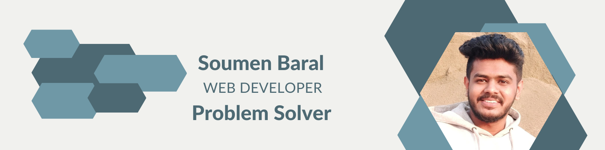

       
<h3 align="center">                             
   
</h3>                                                                                 
   
<!--
    
  
Visitor count
 
  
 
    
  
 

 -->
 
<h3 align="center">A Passionate Full Stack Developer , Competitive Programmer And A Problem Solver From Bangladesh </h3>    

<h2>
        
        <b>About Me</b>
</h2>

 
    
 
        &nbsp;&nbsp;&nbsp;&nbsp;&nbsp;
            I’m currently doing <b>Competitive Programming</b>
    

    

        &nbsp;&nbsp;&nbsp;&nbsp;&nbsp;
        I’m currently learning <b>Data Structures and Algorithms.</b> to advance my coding skills 
    

    

        &nbsp;&nbsp;&nbsp;&nbsp;&nbsp;
        I’m looking to collaborate on <b>OpenSource Projects</b> 
    

    

        &nbsp;&nbsp;&nbsp;&nbsp;&nbsp;
        I really love to meet with new people
    

  
<h2 style='margin-top:30px'>
        
        <b>Connect with me :</b>
</h2>

               

 
  
 
  
<h2 style='margin-top:30px'>
         
        <b>Languages and Tools :</b>
</h2>

 
  
## Frontend

<!--  -->

<!--  -->

<!--  -->

<!--  -->

<!--  -->
## Backend

<!--  -->

<!--  -->

## Tools

<!--  -->

 
 

  <picture>
    <source 
      srcset="https://github-readme-stats.vercel.app/api?username=soumenbaral&count_private=true&theme=radical&show_icons=true"
      media="(prefers-color-scheme: dark)" 
    />
    <source 
      srcset="https://github-readme-stats.vercel.app/api?username=soumenbaral&count_private=true&show_icons=true"
      media="(prefers-color-scheme: light), (prefers-color-scheme: no-preference)" 
    />
    
  </picture>

  <picture>
    <source 
      srcset="https://github-readme-streak-stats-psi-five.vercel.app?user=soumenbaral&theme=vision-friendly-dark&border_radius=4"
      media="(prefers-color-scheme: dark)" 
    />
    <source 
      srcset="https://github-readme-streak-stats-psi-five.vercel.app?user=soumenbaral&border_radius=4"
      media="(prefers-color-scheme: light), (prefers-color-scheme: no-preference)" 
    />
    
  </picture>

<!-- orgs -->

[Virtual Minds]: https://virtualminds.de/en/
[k8s]: https://kubernetes.io
[@aws]: https://github.com/aws
[Westwing]: https://github.com/Westwing-Home-and-Living
[dh]: https://grameendh.com
[React]: https://reactjs.org/
[blog]: https://mildlyboring.com

<!-- unnamed links -->

[1]: https://ipa-reader.com/?text=f%C3%A4h%C3%A6%C3%B0&voice=Filiz
[2]: https://www.zdnet.com/article/the-early-adopter-tax/

<!-- 

 -->

<!-- 
&nbsp;
 -->

